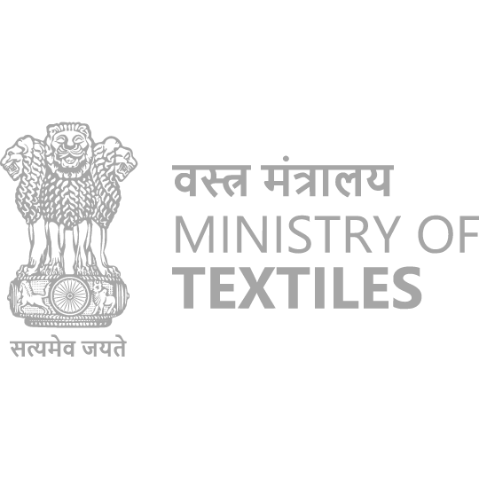

# 
 KnitKraft

<h2 align="center">Application for monitoring of Wool from Farm to Fabric</h2>

<h2 align="center">TEAM VIZION : Winner 🏆 Of Smart India Hackathon 2023 (SIH 2023) 🌟</h2>

<h2 align="center">COMPLETE DESCRIPTION</h2>

### PS ID : SIH1309

### Team ID : 3411

### Idea ID : 11334

### Ministry : Ministry of Textile, Government of India. 

### PS Title :
Application Development for monitoring of Wool from Farm to fabric

### PS Description :
An App-based solution for the wool sector in India which can have the following features required: 
1. Wool Market Information: Provides real-time market information on wool prices, trends, and news.
2. Wool Tracking: Allows users to track the production and transport of their wool from farm to market.
3. Quality Assurance: Provides a platform for wool producers to ensure the quality of their wool and access to wool grading services.
4. Wool Storage and Warehousing: Helps farmers store and manage their wool inventory.
5. Wool Processing: Helps farmers access wool processing services such as shearing, sorting and dyeing.
6. Wool Trading Platform: Allows wool producers to buy and sell wool directly from other farmers or buyers.
7. Online Wool Marketplace: Provides a platform for wool producers to sell their wool directly to buyers.
8. Wool Education and Training: Provides a list of wool producers/artisans region-wise, and state-wise data to provide educational resources and training to help them improve their production, quality, design and marketing skills.

### Idea Title :
KnitKraft, all in one multilingual app that serves farmers, buyers & sellers in the wool industry.

### Idea Description :
KnitKraft is a comprehensive platform targeting each and every sector in the wool industry from farmers to processing units to consumers. A farmer (shepherd) can utilise this platform for all kinds of wool management including wool tracking, trading, access to various wool related services, bulk buying and the option to store and transport wool to warehouses. The app is also designed for buyers and sellers allowing them to negotiate, list products and sell it to consumers all throughout the same application. Quality assurance of wool is also provided to ensure authenticity. Facility of live and recorded sessions for farmers are also available to boost the whole industry. This platform also has a statistics section tracking wool prices to allow farmers to sell their products at a maximum profit.
We also have a solid business model 
1) ESCROW based payment method between farmers and other parties. 
2) A fee for Quality Assurance Certification. 
It’s high time that this unorganised Wool industry be streamlined and bring a huge revolution in the textile industry altogether.

### Abstract/ Summary :
Among all the Textile Industry, the sector facing the most significant challenge is the Wool Industry due to lack of a well established market. The major problem also lies in the outdated and inadequate pre-and post loom processing facilities and no educational institute for Wool Technology. As researched TEAM VIZION has identified this as a golden opportunity to revitalise the entire industry, from initial stages of sheep rearing to the final fabric creation.
In summary, KnitKraft is a versatile, role-based application catering to the wool industry's needs. It combines marketplace features, quality assurance, education, and services to empower farmers, buyers, and sellers, offering real-time information and support under one platform.
Most shepherds in the country rear sheep not by choice, but due to lack of other options. We hope that KnitKraft would be able to envision and bring more people into the wool industry by their own choices, creating new job opportunities and taking our nation a step forward.

### Status :
We have implemented these features:
1. A cross-platform support application to streamline the complete process from Sheep Farming to Selling Fabric to consumers.
2. This same platform provide customised interface as per their user role i.e. Farmers, Service providers, Buyers, Educators, Quality Inspectors, Transportation and Warehouse Partners.
3. One stop platform for farmers, buyers and all types of service providers with native Multilingual Support.
4. An efficient, transparent and multichannel platform to ease the process for wool buyers & sellers to discover real-time wool prices, information and market trends with quality assurance.
5. Real-time tracking of wool from farm to market and providing best buys to farmers through a reverse bidding process.
6. An integrated educational/ training platform to educate farmers about latest market trends, news and practices to increase wool production.

### Tech Stacks Used :
⦿ <b>FrontEnd :</b> 
* 
  
  
   

⦿ <b>BackEnd :</b>
* 
 

⦿ <b>Database :</b>
* 

⦿ <b>Deployment :</b>
* 

### Important URLS :
⭐️ <b>KnitKraft :</b> [Use Mobile Phone for best viewing this Website](https://knitkraft.onrender.com/)

  Some Demo Logins to Test without registering: 
  1. Farmer - Email: farmer@admin.com  Password: 1234@
  2. Teacher - Email: teacher@admin.com  Password: 1234@
  3. Transport - Email: transport@admin.com  Password: 1234@

⭐️ <b>Main PPT :</b> [Click Here to View](https://www.canva.com/design/DAGP_9EsdGI/WQJE7HY9nDG7qmt9gBuDuA/edit)

⭐️ <b>Video : Understanding KnitKraft</b>

[👇🏻👇🏻👇🏻 Click Below 👇🏻👇🏻👇🏻](https://youtu.be/d0B1yQ7u524)

⭐️ <b>Initial Pre-Selection Blue Print</b> : [Click Here to View](https://drive.google.com/file/d/1WngMiKF48ZAOP37BUc6nZq6fWnPLF6PT/view?usp=sharing)

⭐️ <b>SIH Template PPT :</b> [Click Here to View](https://drive.google.com/file/d/1BhjldMFYz4rB5Iu3gg36Oxn4-SusAxQG/view?usp=drive_link)

⭐️ <b>As Project Report :</b> [Click Here to View](https://drive.google.com/file/d/1tJvVhpuGaO4L66uNkokVx4RxQ1jWoHHH/view?usp=sharing)

⭐️ <b>Extra : You can also watch our fun VLOG 😅</b>

[👇🏻👇🏻👇🏻 Click Below 👇🏻👇🏻👇🏻](https://youtu.be/kYKLeQ5mnIA)

---

## Project Created & Maintained By

## :heart: Team Vision
1. [Krishna Raj](https://github.com/krishna-raz)
2. [Ujjwal Raj](https://github.com/uzibytes)
3. [Rajnish Puri](https://github.com/RajnishPuri)
4. [Prashant Kumar](https://github.com/PkThunderBolt)
5. [Himanshu Kumar](https://github.com/I-Himanshu)
6. [Anamika](https://github.com/Anamika282004)

### Hire Us

### How-to-run

- Download NodeJS from the Official website [link](https://nodejs.org/) (if not installed)
- Clone this Repository. 
- Open the cloned repository in VS Code.
- Enter command - `npm i` to install all the neccessary packages.
- Then Enter Command - `npm start` to start the application in your local machine.
- Or you can directly use our application on your phone by accessing this website [link](https://knitkraft.onrender.com/).

## Support

💙 If you like this project, give it a '⭐' and share it with your friends!
You are free to send us PRs and issues, We'd love to help and improve this.

<h1 align="center">🙏 THANK YOU 🙏</h1>

